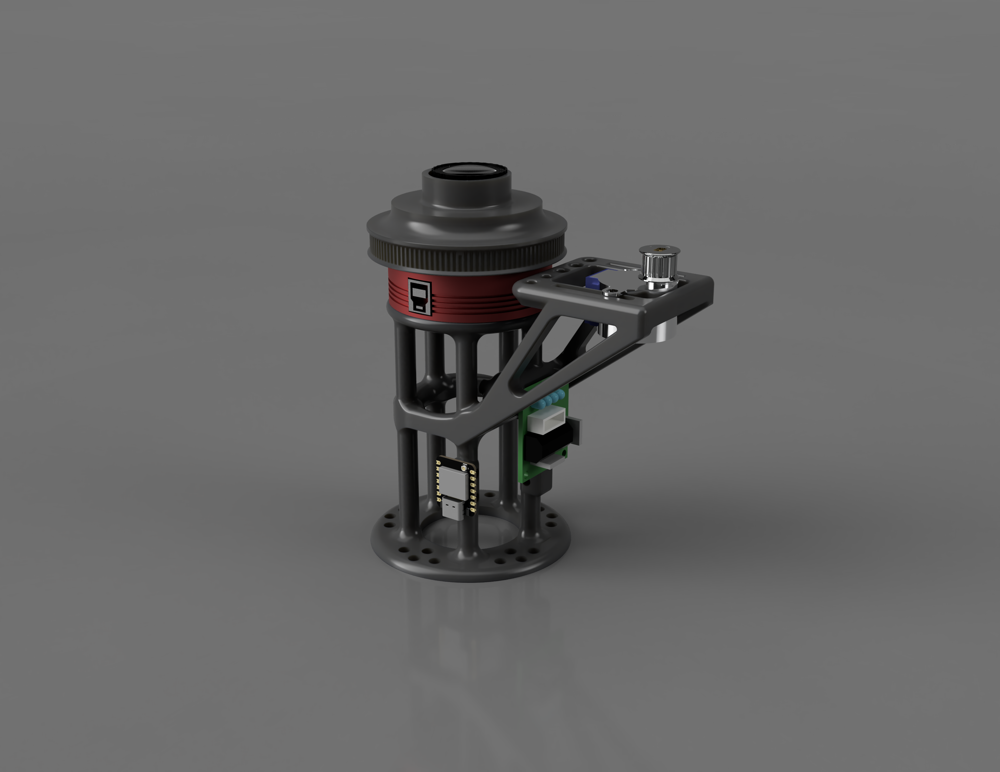

# AllSky ESP32 & Pi5 Focuser

A collection of stepper motor focus controllers designed for AllSky camera systems. This repository contains two implementations: one for ESP32-S3 microcontrollers and one for the Raspberry Pi 5.

<div align="center">
  
</div>


<div align="center">
  <h3>Web Interface Demo (YouTube)</h3>
  <a href="https://youtu.be/qwrPY6xvNLg">
    
  </a>
</div>

## Table of Contents
- [Repository Overview](#repository-overview)
- [Common Features](#common-features)
- [Hardware Requirements](#hardware-requirements)
- [3D Printed Parts](#3d-printed-parts)
- [Quick Start](#quick-start)
- [API Endpoints](#api-endpoints)
- [Web Interface Features](#web-interface-features)
- [Default Configuration](#default-configuration)
- [Version Selection Guide](#version-selection-guide)
- [Documentation](#documentation)
- [Contributing](#contributing)
- [License](#license)
- [Related Projects](#related-projects)
- [Safety Notes](#safety-notes)
- [Troubleshooting](#troubleshooting)

## Repository Overview

This repository provides two separate but compatible focus controller implementations:

### [ESP32 Stepper Motor Control](./ESP32_stepper_motor_control/)
A feature-rich focus controller firmware for XIAO ESP32-S3 microcontrollers with:
- **WiFiManager**: Easy WiFi setup via captive portal
- **WebSocket**: Real-time position updates
- **ElegantOTA**: Over-the-air firmware updates
- **Web Interface**: Full-featured browser-based control
- **REST API**: Programmatic control
- **Persistent Storage**: Remembers position across reboots
- **Safety Features**: Soft/hard limits with validation

### [Pi5 Stepper Motor Control](./pi5_stepper_motor_control/)
A Flask-based focus controller for Raspberry Pi 5 with:
- **Systemd Service**: Runs automatically on boot
- **GPIO Control**: Native gpiozero support for Pi 5
- **Web Interface**: Browser-based control panel
- **REST API**: Full API for automation
- **Auto-install**: Simple installation script
- **Persistent Storage**: JSON-based configuration

## Common Features

Both implementations share these core capabilities:

- **28BYJ-48 Stepper Motor Support**: Half-step sequence for smooth motion
- **Position Tracking**: Absolute position with persistent storage
- **Variable Speed Control**: Adjustable motor speed (50-600 steps/sec)
- **Software Limits**: Configurable min/max travel limits
- **Home Position**: Zero position calibration
- **Nudge Controls**: Fine and coarse position adjustments
- **Web UI**: Modern, responsive interface with real-time updates
- **REST API**: Complete programmatic control

## Hardware Requirements

### For ESP32 Version
- **XIAO ESP32-S3** or compatible ESP32 board
- **28BYJ-48 Stepper Motor** (12V)
- **ULN2003 Driver Board**
- **12V Power Supply** (for motor)

### For Pi5 Version
- **Raspberry Pi 5** (or compatible Pi with GPIO)
- **28BYJ-48 Stepper Motor** (12V)
- **ULN2003 Driver Board**
- **12V Power Supply** (for motor)

### Wiring (Both Versions)

| ULN2003 Pin | ESP32 GPIO | Pi5 GPIO |
|-------------|------------|----------|
| IN1         | GPIO 1     | GPIO 26  |
| IN2         | GPIO 2     | GPIO 19  |
| IN3         | GPIO 3     | GPIO 13  |
| IN4         | GPIO 4     | GPIO 6   |

**Important:** Connect the motor power supply GND to the microcontroller/Pi GND to establish a common ground.

## 3D Printed Parts

The 3D print files for the main camera gear and the camera mount are available on Printables:

- [ZWO ASI676MC AllSky Focusing Mount and Gear](https://www.printables.com/model/1563632-zwo-asi676mc-allsky-focusing-mount-and-gear)

## Quick Start

### ESP32 Version
1. Install required Arduino libraries (see ESP32 folder README).
2. Open `stepper_motor.ino` in Arduino IDE.
3. Select "XIAO ESP32S3" as the board.
4. Upload to your ESP32.
5. Connect to "FocusController-AP" WiFi (password: `12345678`).
6. Configure your WiFi network.
7. Access the web interface at the displayed IP address.

### Pi5 Version
1. Clone this repository on your Pi 5.
2. Navigate to `pi5_stepper_motor_control`.
3. Run installation: `chmod +x install.sh && ./install.sh`.
4. Access the web interface at `http://<pi-ip>:8080`.

## API Endpoints

Both versions provide compatible REST APIs:

| Endpoint | Method | Description |
|----------|--------|-------------|
| `/api/status` | GET | Get current status (position, target, speed, etc.) |
| `/api/position` | POST | Set target position `{"position": 1000}` |
| `/api/speed` | POST | Set motor speed `{"speed": 300}` |
| `/api/nudge` | POST | Relative movement `{"steps": 100}` |
| `/api/zero` | POST | Set current position as zero |
| `/api/stop` | POST | Emergency stop |
| `/api/settings/max` | POST | Set max travel limit `{"maxSteps": 20000}` |
| `/api/settings/stepsperrot` | POST | Set steps per rotation `{"stepsPerRot": 4096}` |

### ESP32 Additional Endpoints
| Endpoint | Method | Description |
|----------|--------|-------------|
| `/api/reboot` | POST | Reboot the device |
| `/api/logs` | GET | Get recent error logs |
| `/update` | GET | ElegantOTA firmware update page |

### WebSocket (ESP32 Only)

The ESP32 version also provides a WebSocket on port 81 for real-time updates:
```
ws://esp32-ip:81
```

## Web Interface Features

See it in action: [Web Interface Demo](https://youtu.be/qwrPY6xvNLg)

Both versions include a modern web interface with:
- **Real-time Position Display**: Visual gauge and numeric display
- **Target Position Control**: Set exact position or use nudge controls
- **Speed Adjustment**: Slider control for motor speed
- **Home Functions**: Go to zero or set current position as zero
- **Visual Feedback**: Animated motor shaft rotation
- **Status Indicators**: Running state and limit warnings
- **Emergency Stop**: Large, accessible stop button
- **Settings Panel**: Configure limits and motor parameters

## Default Configuration

Both versions use similar default settings:

- **Max Steps**: ±20,000 (configurable)
- **Steps Per Rotation**: 4,096 (28BYJ-48 in half-step mode)
- **Default Speed**: 100-250 steps/sec
- **Speed Range**: 50-600 steps/sec
- **Soft Limit Warning**: 500 steps from limit

## Version Selection Guide

Choose the **ESP32 version** if you:
- Want a standalone, compact controller.
- Need WiFi connectivity without additional hardware.
- Want OTA firmware updates.
- Prefer WebSocket for real-time updates.
- Need a lower-power solution.

Choose the **Pi5 version** if you:
- Already have a Raspberry Pi in your AllSky setup.
- Want easier Python-based customization.
- Need to integrate with other Pi services.
- Prefer systemd service management.
- Want to run additional camera control software.

## Documentation

Detailed documentation for each version can be found in their respective folders:

- [ESP32 Version Documentation](./ESP32_stepper_motor_control/README.md)
- [Pi5 Version Documentation](./pi5_stepper_motor_control/README.md)

## Contributing

Contributions are welcome. Please feel free to submit issues or pull requests.

## License

MIT License - See individual project folders for details.

## Related Projects

- [AllSky Camera Software](https://github.com/thomasjacquin/allsky)
- [ZWO ASI Camera SDK](https://www.zwoastro.com/software/)

## Safety Notes

- Always test motor movement limits before unattended operation.
- Ensure proper power supply for your stepper motor (typically 12V, 1A+).
- Use the emergency stop if motor behavior is unexpected.
- The software limits are advisory; consider mechanical end stops for critical applications.
- Back up your configuration before firmware updates (ESP32).

## Troubleshooting

### ESP32
- **Won't connect to WiFi**: Use AP mode (FocusController-AP) to reconfigure.
- **Motor doesn't move**: Check wiring and power supply.
- **Position resets**: Replace CR2032 battery on ESP32 board if equipped.

### Pi5
- **Service won't start**: Check logs with `sudo journalctl -u pi5-focuser -n 50`.
- **GPIO errors**: Ensure user in `gpio` group: `sudo usermod -a -G gpio $USER`.
- **Module not found**: Verify virtual environment activation in service file.